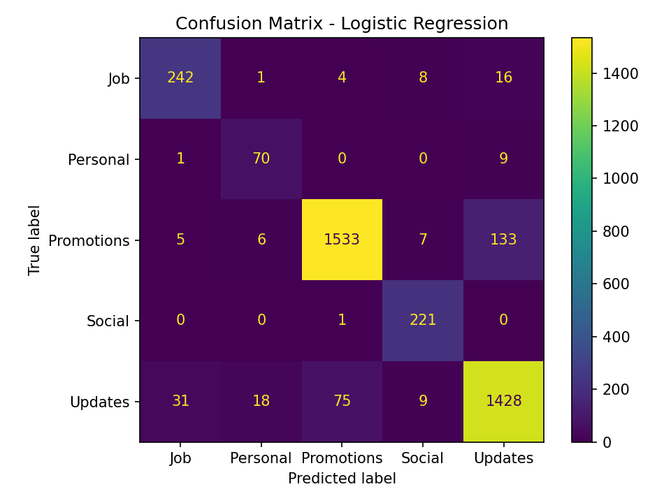

# Email Classifier

A multi-class machine learning pipeline that automatically categorizes Gmail messages into meaningful groups — including a custom **Job/Application** category not provided by Gmail's default tabs.

Built on 19,087 real emails from a personal Gmail account, covering the full ML pipeline: data acquisition, parsing, weak labeling, feature engineering, and model evaluation.

---

## Results

| Model | Accuracy | Macro F1 |
|---|---|---|
| Naive Bayes | 0.88 | 0.80 |
| **Logistic Regression** | **0.92** | **0.89** |

**Per-class performance (Logistic Regression):**

| Class | Precision | Recall | F1 | Support |
|---|---|---|---|---|
| Job | 0.87 | 0.89 | 0.88 | 271 |
| Personal | 0.74 | 0.88 | 0.80 | 80 |
| Promotions | 0.95 | 0.91 | 0.93 | 1,684 |
| Social | 0.90 | 1.00 | 0.95 | 222 |
| Updates | 0.90 | 0.91 | 0.91 | 1,561 |



**Key findings from the confusion matrix:**
- Social is the cleanest class (221/222 correct) — social notifications have highly distinctive vocabulary
- The dominant confusion pattern is Updates ↔ Promotions ↔ Job, which makes intuitive sense — all three share vocabulary around announcements, opportunities, and calls to action
- Promotions → Updates is the largest single error (133 emails), likely because promotional emails often use notification-style language
- Personal class is the hardest to classify (F1 0.80) — personal emails are defined by what they're *not* rather than distinctive vocabulary

---

## Problem

Gmail's automatic categories (Promotions, Updates, Social) are useful but incomplete. Specifically:

- **No Job/Application category exists** — internship confirmations, interview requests, and ATS notifications get scattered across Updates and Primary with no distinction
- **Primary inbox is a dumping ground** — important personal emails mixed with everything Gmail couldn't categorize
- **No urgency signal** — a cold promotional email and an interview invitation look identical in Gmail's default view

This project builds a classifier that learns these distinctions from real email data.

---

## Classes

| Label | Source | Count (training) |
|---|---|---|
| Promotions | Gmail category | 6,734 |
| Updates | Gmail category + Bills folded in | 6,245 |
| Job | Custom heuristic (see below) | 1,082 |
| Social | Gmail category | 887 |
| Personal | Gmail category + Primary folded in | 321 |

---

## Pipeline

### 1. Data Acquisition
Exported personal Gmail via Google Takeout, producing an `.mbox` file containing 41,570 emails (2019–2026). Filtered to the most recent 2 years (19,087 emails) for training, since email behavior and subscriptions change significantly over time.

### 2. Parsing (`src/parse_mbox.py`)
Python's built-in `mailbox` module handles `.mbox` format splitting. The custom parser handles three real-world format complexities:

- **Multipart emails** (plain text + HTML bundled together) — prefers plain text to avoid HTML noise
- **HTML-only emails** — strips tags, scripts, and style blocks using BeautifulSoup
- **Encoding edge cases** — decodes MIME encoded-word format (`=?UTF-8?B?...?=`) in subject lines, handles charset detection and UTF-8 fallback

A notable debugging challenge: an initial typo (`get_content_charset` without parentheses) caused a 99.7% silent failure rate — 41,469 of 41,570 emails were silently skipped with no error raised, because the broad `except` block was catching and suppressing the `TypeError`. Diagnosed by temporarily printing `repr(e)` for caught exceptions rather than treating "no crash" as correctness.

### 3. Labeling (`src/label_data.py`)
Labels are assembled from two sources:

**Gmail's automatic categories** serve as weak labels for 4 of the 5 classes. The raw `X-Gmail-Labels` header is a compound string like `"Inbox,Important,Opened,Category Updates,Unread"` — a regex extracts just the category portion using `re.findall(r"Category (\w+)", label_str, re.IGNORECASE)`.

**A custom heuristic** flags Job/Application candidates since Gmail has no such category:
- Sender domain matching against known ATS platforms: Greenhouse, Lever, Workday, iCIMS, SmartRecruiters, Ashby, Handshake, RippleMatch, Jobright, WayUp
- Subject keyword matching: "application received", "interview", "assessment", "coding challenge", "phone screen", etc.
- LinkedIn special-cased: blanket domain matching flagged 4,786 emails (connection requests, notifications, ads). Restricted to LinkedIn emails where subject also matches job-specific keywords.

Iterative refinement through diagnostic-driven decisions:
```
7,126 candidates → identified LinkedIn noise via domain breakdown analysis
2,559 candidates → LinkedIn restricted to job-subject keyword matches  
1,915 candidates → fastweb.com (scholarships) and .edu domains (college admissions) added to negative filter
1,560 candidates → final count, all top 15 domains are legitimate job platforms
```

Label design decisions made explicitly:
- `Bills` (1 email) folded into `Updates` — too small for its own class
- `Primary` (398 emails, no Gmail category) folded into `Personal` — closest semantic match
- `Forums` (29 emails after filtering) dropped — insufficient samples for reliable classification
- Job label overrides Gmail category — heuristic signal trusted over Gmail's auto-categorization
- Accepted weak/noisy labels for Job class rather than manually reviewing 1,560 emails — realistic tradeoff between label quality and throughput

### 4. Feature Engineering (`src/train.py`)
- Subject and body combined into a single text field: `"subject: {subject} body: {body}"`
- The `"subject: "` prefix signals to the model that what follows is a subject line, which carries stronger classification signal than body text
- TF-IDF vectorization with `max_features=50,000`, `ngram_range=(1,2)`, `sublinear_tf=True`
- Bigrams (`ngram_range=(1,2)`) capture phrases like "phone screen", "coding challenge", "job alert" that are more informative than individual words
- Vectorizer fit on training data only — fitting on the full dataset before splitting would constitute data leakage, inflating test metrics

### 5. Modeling
- **Naive Bayes** (`MultinomialNB`): probabilistic baseline, assumes word independence
- **Logistic Regression** (`class_weight='balanced'`): learns per-word weights per class, compensates for class imbalance automatically

Stratified 80/20 train/test split (`stratify=y`) ensures each class is proportionally represented in both sets — important given significant class imbalance (Promotions + Updates = ~75% of data).

---

## Why Macro F1, Not Accuracy

With Promotions and Updates comprising ~75% of the dataset, a naive model that always predicts the majority class would score high accuracy while being completely useless for Job, Personal, and Social classification.

Macro F1 averages F1 score across all classes with equal weight regardless of class size — it correctly penalizes a model that ignores minority classes.

---

## Project Structure

```
email-classifier/
├── data/
│   ├── raw/                    # .mbox file (gitignored — contains personal email data)
│   └── processed/
│       ├── emails.csv          # Parsed email data (gitignored)
│       ├── emails_labeled.csv  # Labeled dataset (gitignored)
│       └── confusion_matrix_lr.png
├── src/
│   ├── parse_mbox.py           # Gmail .mbox parser
│   ├── label_data.py           # Weak labeling + Job heuristic
│   ├── explore_candidates.py   # Diagnostic tool for label inspection
│   └── train.py                # Feature engineering, training, evaluation
├── requirements.txt
└── README.md
```

---

## Reproducing This Project

```bash
# Install dependencies
pip install -r requirements.txt

# Parse your own Gmail export (requires Google Takeout .mbox)
python src/parse_mbox.py \
  --input data/raw/your_export.mbox \
  --output data/processed/emails.csv

# Generate labels
python src/label_data.py \
  --input data/processed/emails.csv \
  --output data/processed/emails_labeled.csv

# Train and evaluate
python src/train.py
```

---

## What's Next

- **Error analysis**: manually inspect the 133 Promotions→Updates misclassifications and 31 Job→Updates misclassifications to understand what vocabulary is causing confusion
- **Feature engineering**: add sender domain, time of day, and email length as non-text features alongside TF-IDF
- **Personal class improvement**: the weakest class (F1 0.80) — investigate whether additional features or manual label refinement improves recall
- **Ensemble**: combine Logistic Regression and Naive Bayes predictions
- **Transformer model**: fine-tune DistilBERT on subject lines — likely meaningful improvement for Job/Personal distinction where word order matters

---

## Key Learnings

**On data engineering:**
A model is only as good as its labels. The most time-intensive part of this project was not training — it was designing the labeling strategy, diagnosing silent failures in the parse pipeline, and iteratively refining the Job heuristic from 17.1% false positive rate to 3.8% through domain-level analysis rather than guesswork.

**On evaluation:**
Accuracy is a misleading metric for imbalanced multi-class problems. Reporting macro F1 and per-class metrics forces honest accounting of model performance across all categories, not just the majority classes.

**On weak supervision:**
Gmail's automatic categories are imperfect but useful — they provide free labels for millions of emails without manual annotation. Treating them as noisy ground truth rather than gospel, and designing around their limitations (no Job category, Primary as catch-all), is what made this project tractable.
